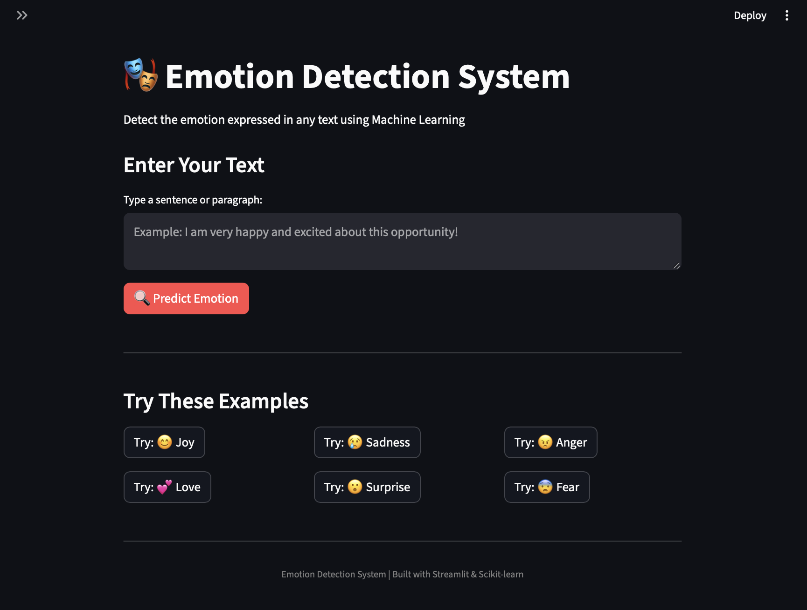

# 🎭 Emotion Detection System

A Machine Learning-powered Emotion Detection application that analyzes text and predicts the underlying emotion using Natural Language Processing (NLP) techniques.

The project includes:

* 📊 Data preprocessing and visualization
* 🔤 TF-IDF feature extraction
* 🤖 Machine Learning model training
* 📈 Model evaluation and comparison
* 🌐 Interactive Streamlit web application

---

## 🚀 Features

* Detect emotions from user-entered text
* Supports 6 emotion classes:

  * 😊 Joy
  * 😢 Sadness
  * 😠 Anger
  * 💕 Love
  * 😮 Surprise
  * 😨 Fear
* Real-time predictions
* Confidence score visualization
* Probability distribution for all emotions
* Clean and user-friendly Streamlit interface

---

## 🧠 Machine Learning Pipeline

### 1. Data Preprocessing

The text undergoes the following preprocessing steps:

* Convert text to lowercase
* Remove punctuation
* Remove numbers
* Remove extra whitespace
* Remove stopwords using TF-IDF Vectorizer

### 2. Feature Extraction

TF-IDF Vectorization is used to convert text into numerical features.

Parameters:

```python
TfidfVectorizer(
    max_features=5000,
    ngram_range=(1, 2),
    min_df=2,
    max_df=0.95,
    stop_words='english'
)
```

### 3. Models Trained

#### Multinomial Naive Bayes

A fast and effective baseline model for text classification.

#### Logistic Regression

Selected as the final model because it achieved the best performance.

```python
LogisticRegression(
    max_iter=1000,
    class_weight='balanced',
    random_state=42
)
```

---

## 📊 Model Evaluation

Metrics used:

* Accuracy Score
* Classification Report
* Confusion Matrix

The Logistic Regression model achieved approximately **89%+ accuracy** on the test dataset.

---

## 🗂️ Project Structure

```text
EmotionDetection/
│
├── app.py
├── train_model.py
├── emotion_model.pkl
├── tfidf_vectorizer.pkl
├── emotion_labels.pkl
├── preprocessing_info.txt
├── train.txt
├── requirements.txt
└── README.md
```

---

## 🛠️ Technologies Used

* Python
* Pandas
* NumPy
* Scikit-learn
* NLTK
* Matplotlib
* Seaborn
* Streamlit
* Joblib

---

## ⚙️ Installation

### Clone Repository

```bash
git clone https://github.com/yourusername/emotion-detection-system.git
cd emotion-detection-system
```

### Create Virtual Environment

```bash
python -m venv venv
```

Activate:

**Windows**

```bash
venv\Scripts\activate
```

**Mac/Linux**

```bash
source venv/bin/activate
```

### Install Dependencies

```bash
pip install -r requirements.txt
```

---

## ▶️ Run the Application

```bash
streamlit run app.py
```

The application will open in your browser at:

```text
http://localhost:8501
```

---

## 🧪 Example Inputs

### Joy

```text
I just got the best news ever! I'm so excited and happy!
```

### Sadness

```text
I feel lonely and disappointed today.
```

### Anger

```text
I can't believe what happened. This is unacceptable!
```

### Love

```text
You mean everything to me and I love spending time with you.
```

### Surprise

```text
Wow! I never expected that to happen.
```

### Fear

```text
I'm nervous and worried about tomorrow's interview.
```

---

## 📈 Future Improvements

* Deep Learning Models (LSTM, GRU)
* Transformer Models (BERT, RoBERTa)
* Emotion Intensity Detection
* Multi-label Emotion Classification
* Model Deployment on Cloud
* REST API Integration

---

## 📷 Application Preview



---

## 👩‍💻 Author

**Saiqa Jat**

Software Engineering Student | Data Science & AI Enthusiast

GitHub: https://github.com/SaiqaJat

---

## ⭐ Support

If you found this project useful, consider giving it a star ⭐ on GitHub.
